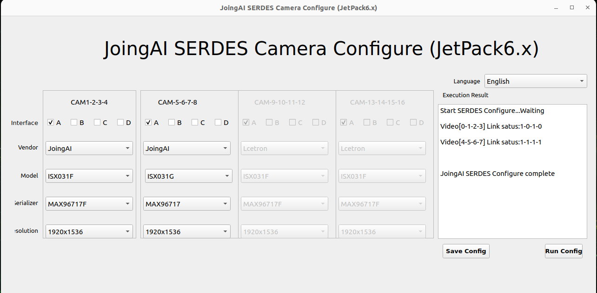
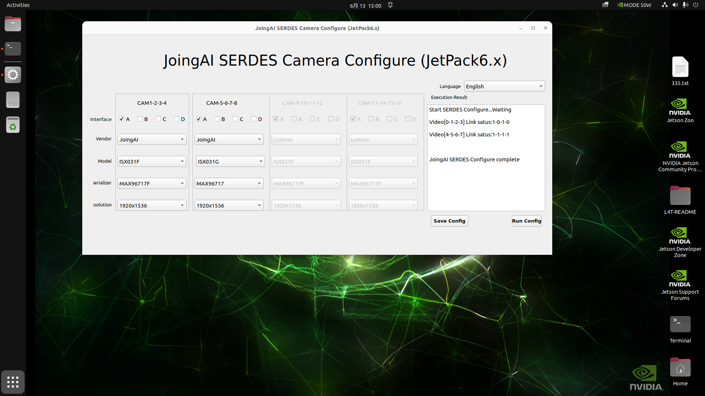

# FG24 8CH YUV Cameras JetPack 6.2.x (R36.4.x) SOP

Directory: JetPack_6.2_R36.4_JAO_FG24_8CH_YUV_Cameras

## 1. Objectives

- Complete firmware/application upgrade on Jetson AGX Orin + FG24 8CH YUV Cameras kit.
- Support configuration and usage of 8-channel YUV cameras.

## 2. Upgrade Package Content Description

- Upgrade script
  - fg24.8ch.JAO.R36.4.x.sh
- DTBO Device Tree Overlay
  - `rootfs/boot/tegra234-p3737-camera-fzcam-fg24-8ch-4lanes.dtbo`
- Drivers and configuration
  - `rootfs/lib/modules/*/updates/drivers/media/i2c/fzcam.ko`
- Applications and configuration
  - `fzcam_app/usr/local/bin/fzcam_ui`
  - `fzcam_app/usr/local/bin/fzcam_cfg`
  - `fzcam_app/etc/fzcam_cfg.ini`
  - `fzcam_app/fzcam_cfg.service`
- Demo images and video
  - `pics_videos/fg24_8ch_fzcam_ui.png`
  - `pics_videos/fg24_8ch_fzcam_ui_2.png`
  - `pics_videos/fg24_8ch_agx_orin_demo_video.webm`

## 3. Execute Upgrade on Jetson

Copy the entire directory to Jetson (choose any method):

```bash
scp -r JetPack_6.2.2_R36.5_JAO_FG24_8CH_YUV_Cameras nvidia@<JETSON_IP>:
```

Enter the directory on Jetson and execute the upgrade script (sudo required):

```bash
cd ~/JetPack_6.2.2_R36.5_JAO_FG24_8CH_YUV_Cameras
sudo bash fg24.8ch.JAO.R36.5.x.sh
```

What the script does (key points):
- Check if JetPack version is R36.5.0/5.3/5.4/5.7
- Install driver `fzcam.ko` and run `insmod` / `depmod`
- Install configuration file `/etc/fzcam_cfg.ini`
- Install applications:
  - `/usr/local/bin/fzcam_cfg`
  - `/usr/local/bin/fzcam_ui`
- Install and enable systemd service: `/etc/systemd/system/fzcam_cfg.service`
- Install DTBO and configure hardware via Jetson-IO
- Restart after secondary confirmation

## 4. Post-restart Configuration and Image Verification

### 4.1 Run UI Configuration

```bash
sudo fzcam_ui
```

After selecting the manufacturer/model in the UI:
- Click "Save Configuration"
- Then click "Run Configuration"
- Observe if Link status is 1 (indicating the link is locked and has video data)




### 4.2 GStreamer Quick Verification

Taking video0 as an example:

```bash
gst-launch-1.0 v4l2src device=/dev/video0 ! 'video/x-raw,format=UYVY,width=1920,height=1080' ! videoconvert ! fpsdisplaysink video-sink=xvimagesink sync=false
```

## 5. Common Issues

### 5.1 JetPack Version Mismatch

The script will check if `/etc/nv_tegra_release` is R36.4.0/4.3/4.4/4.7, and exit if it doesn't match.

### 5.2 No Video Nodes / No Image

Symptoms: No video nodes or no image output.
Solution: Confirm the camera connection is correct, re-execute the upgrade script and restart.
