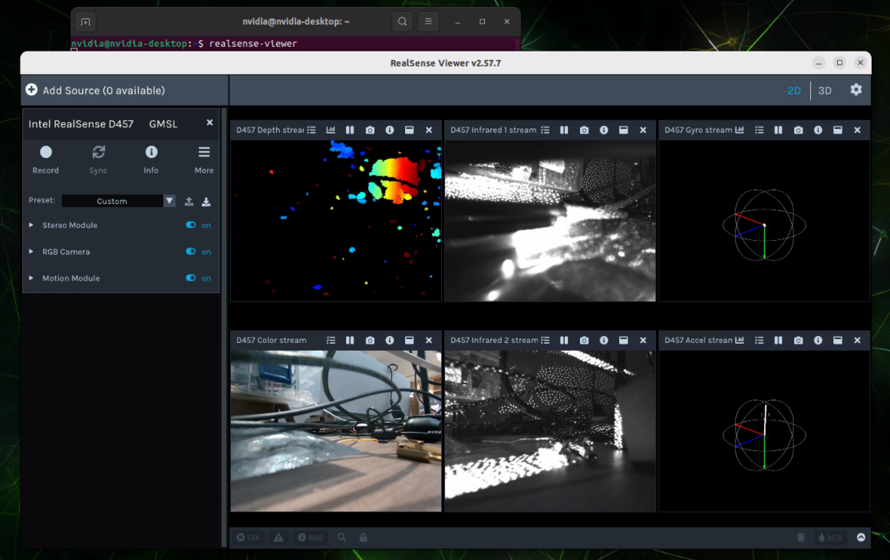

# D457 + FG96 8CH (JetPack 6.2.2 / R36.5) 操作手册

包目录：`D457_JAO_FG96_8CH_Driver_JP6.2.2_R36.5`

## 1. 包含内容

- DTBO
  - `tegra234-p3737-camera-4xd4xx-fg96-8ch-overlay.dtbo`（4x D457）
  - `tegra234-p3737-camera-8xd4xx-fg96-8ch-overlay.dtbo`（8x D457）
- 内核模块
  - `tegra-camera.ko`
  - `capture-ivc.ko`
  - `nvhost-nvcsi-t194.ko`
  - `videodev.ko`
  - `d4xx.ko`
  - `max9295.ko`
  - `max9296.ko`
- 辅助脚本
  - `copy_d4xx_to_target.fg96.8ch.sh`

## 2. 将升级包拷贝到 Jetson

```bash
scp -r D457_JAO_FG96_8CH_Driver_JP6.2.2_R36.5 nvidia@<JETSON_IP>:
```

在 Jetson 上：

```bash
cd ~/D457_JAO_FG96_8CH_Driver_JP6.2.2_R36.5
```

## 3. 安装内核模块

执行辅助脚本（需要 sudo）：

```bash
sudo bash copy_d4xx_to_target.fg96.8ch.sh
```

## 4. 选择 DTBO（Jetson-IO）并重启

### 4.1 4x D457（CAM0/2/4/6，仅数据通道）

```bash
sudo cp tegra234-p3737-camera-4xd4xx-fg96-8ch-overlay.dtbo /boot/
sudo /opt/nvidia/jetson-io/config-by-hardware.py -n 2="Jetson Camera FG96_8CH_D457x4"
sudo reboot
```

### 4.2 8x D457（CAM0~7，深度 + RGB 通道）

```bash
sudo cp tegra234-p3737-camera-8xd4xx-fg96-8ch-overlay.dtbo /boot/
sudo /opt/nvidia/jetson-io/config-by-hardware.py -n 2="Jetson Camera FG96_8CH_D457x8"
sudo reboot
```

## 5. 重启后快速检查

```bash
uname -r
lsmod | egrep 'd4xx|max9295|max9296|tegra_camera|capture_ivc|nvhost_nvcsi' || true
ls -l /dev/video* || true
```


## 6. Realsense Viewer



<br />
