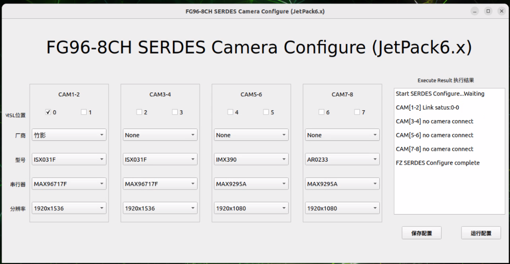

# FG96 8CH YUV Cameras JetPack 7.2 (R39.2.x) SOP

目录：JetPack_7.2_R39.2_JAO_FG96_8CH_YUV_Cameras

## 1. 目标

- 在 Jetson AGX Orin + FG96 8CH YUV Cameras 套件上完成固件/应用升级。
- 支持 JetPack 7.2 / R39.2.x 内核（Linux 6.8.12-tegra）。
- 支持 8 通道 YUV 相机的配置和使用。

## 2. 升级包内容说明

- 升级脚本
  - `fg96.8ch.JAO.R39.2.sh`
- DTBO 设备树覆盖
  - `rootfs/boot/tegra234-p3737-camera-fzcam-fg96-8ch-4lanes.dtbo`
- 驱动与配置
  - `rootfs/lib/modules/6.8.12-1021-tegra/updates/drivers/media/i2c/fzcam.ko`
- 应用与配置
  - `fzcam_app/usr/local/bin/fzcam_ui`
  - `fzcam_app/usr/local/bin/fzcam_cfg`
  - `fzcam_app/etc/fzcam_cfg.ini`
  - `fzcam_app/fzcam_cfg.service`
- 演示图片
  - `pics_videos/fg96-8ch-fzcam-ui.png`

## 3. 在 Jetson 上执行升级

将整个目录拷贝到 Jetson（任选一种方式）：

```bash
scp -r JetPack_7.2_R39.2_JAO_FG96_8CH_YUV_Cameras nvidia@<JETSON_IP>:
```

在 Jetson 上进入目录并执行升级脚本（需要 sudo）：

```bash
cd ~/JetPack_7.2_R39.2_JAO_FG96_8CH_YUV_Cameras
sudo bash fg96.8ch.JAO.R39.2.sh
```

脚本做的事情（关键点）：
- 检查 JetPack 版本是否为 R39.2.0 / R39.2.3
- 安装驱动 `fzcam.ko` 并 `insmod` / `depmod`
- 安装配置文件 `/etc/fzcam_cfg.ini`
- 安装应用：
  - `/usr/local/bin/fzcam_cfg`
  - `/usr/local/bin/fzcam_ui`
- 安装并启用 systemd 服务：`/etc/systemd/system/fzcam_cfg.service`
- 安装 DTBO 并通过 Jetson-IO 配置硬件：`Jetson Camera FG96_8CH_8xYUV`
- 二次确认后重启

## 4. 重启后配置与出图验证

### 4.1 运行 UI 配置

```bash
sudo fzcam_ui
```

按 UI 选择厂商/型号后：
- 点击“保存配置”
- 再点击“运行配置”
- 观察 Link status 是否为 1（表示链路已锁定并有视频数据）



### 4.2 GStreamer 快速验证

以 video0（示例）：

```bash
gst-launch-1.0 v4l2src device=/dev/video0 ! 'video/x-raw,format=UYVY,width=1920,height=1080' ! videoconvert ! fpsdisplaysink video-sink=xvimagesink sync=false
```

### 4.3 设备节点检查

```bash
uname -r
# 预期: 6.8.12-1021-tegra

lsmod | grep fzcam
# 预期: fzcam <size> 0

ls -l /dev/video*
# 预期: 多个 /dev/videoX 节点
```

## 5. 常见问题

### 5.1 JetPack 版本不匹配

脚本会检查 `/etc/nv_tegra_release` 是否为 R39.2.0 / R39.2.3，若不匹配会退出。请确认当前系统为 JetPack 7.2。

### 5.2 无视频节点/无图

表现：没有视频节点或无法出图。
处理：
1. 确认相机连接正确
2. 重新执行升级脚本并重启
3. 检查 DTBO 是否被正确启用：`sudo /opt/nvidia/jetson-io/config-by-hardware.py -n 2="Jetson Camera FG96_8CH_8xYUV"`

### 5.3 内核模块路径错误

如果驱动 `fzcam.ko` 与当前 `uname -r` 不匹配，请将对应内核版本的 `fzcam.ko` 放入 `rootfs/lib/modules/<实际内核版本>/updates/drivers/media/i2c/` 后再运行脚本。