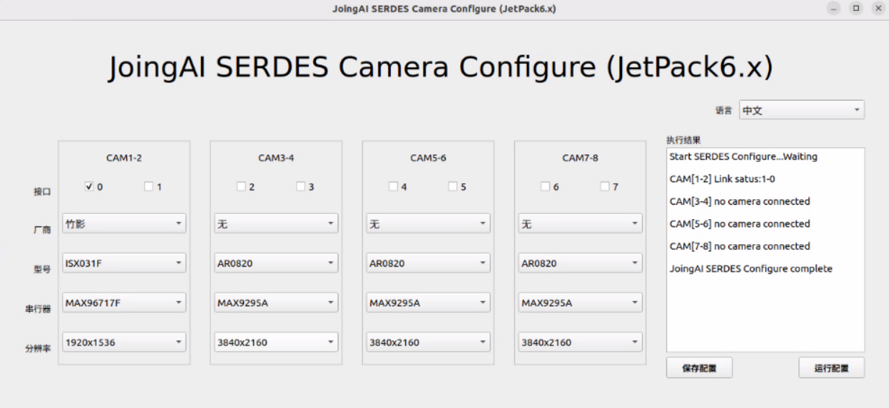
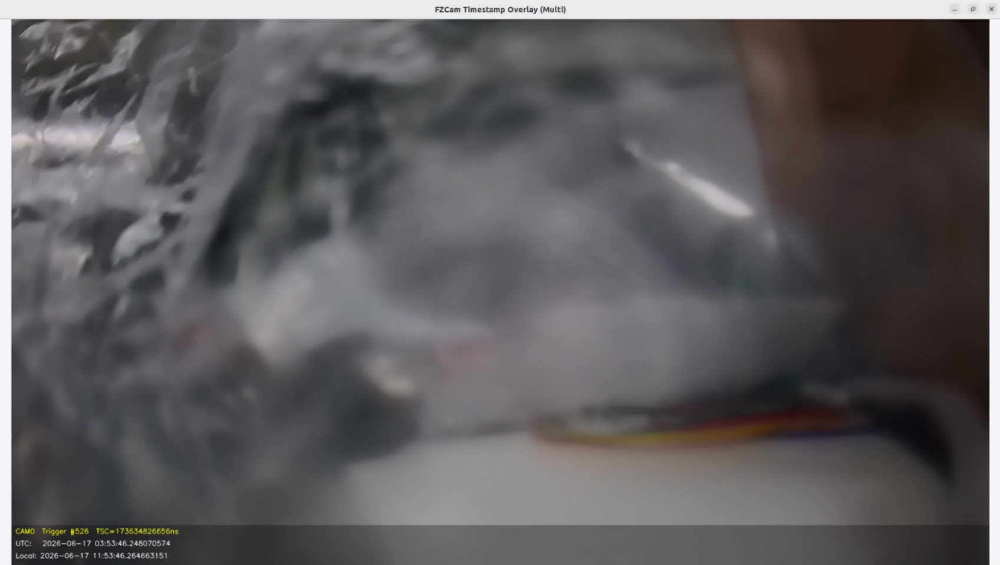

# NVIDIA Jetson AGX Orin 相机同步触发

**适用平台**：

NVIDIA Jetson AGX Orin（JetPack 6\.x）

**代码仓库**：

https://github\.com/JoingAI/serdes\_camera\_jetson/tree/main/Jetson\_AGX\_Orin\_Devkits/fzcam\_sync

**同步功能**：

1\~16 路相机在 **硬件触发信号（PWM 上升沿）** 下同步采集，并把高精度时间戳叠在画面上

CAM0  Trigger \#123  TSC=12345678901234ns      ← 黄色

UTC:   2026\-06\-12 14:30:05\.123456789

Local: 2026\-06\-12 22:30:05\.123456789

具体详细说明：可查看README\.md

**操作说明**：

以FG96\-8CH为例：

打开相机配置界面,并选择：

```Plain Text
sudo fzcam_ui
```



**一键启动相机：**

```Plain Text
sudo ./run.sh -N 4 -i 0 -w 1920 -h 1080
```


相机预览示例：




