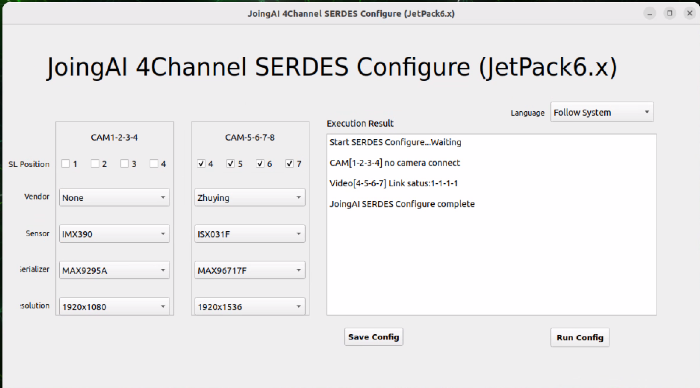

# FG 4CH FZCAM JetPack 6.x (R36.4.x) SOP (English)

Directory: JetPack_6.x_4CH_SERDES

## 1. Objectives

- Complete firmware/application upgrade on Jetson Orin NX/Nano + FG 4CH SerDes kit.
- Support two CSI connection methods: 2lane / 4lane:
  - 2lane: Official CAM0 interface
  - 4lane: Official CAM1 interface

## 2. Upgrade Package Content Description

- Upgrade scripts
  - fg.4ch.onx.2lane.R36.4.x.sh
  - fg.4ch.onx.4lane.R36.4.x.sh
- Drivers and dtbo
  - `rootfs/lib/modules/*/updates/drivers/media/i2c/fzcam.ko`
  - `rootfs/boot/tegra234-p3767-camera-p3768-serdes-4ch-2lanes.dtbo`
  - `rootfs/boot/tegra234-p3767-camera-p3768-serdes-4ch-4lanes.dtbo`
- Applications and configuration
  - `fzcam_app/usr/local/bin/fzcam_ui`
  - `fzcam_app/usr/local/bin/fzcam_cfg.2lane`
  - `fzcam_app/usr/local/bin/fzcam_cfg.4lane`
  - `fzcam_app/etc/fzcam_cfg.ini`
  - `fzcam_app/fzcam_cfg.service`
- Video stream verification
  - JoingAI-4Channel-SERDES-Cameras-Operate-Video.webm

## 3. Execute Upgrade on Jetson

Copy the entire directory to Jetson (choose any method):

```bash
scp -r JetPack_6.x_4CH_SERDES nvidia@<JETSON_IP>:
```

Enter the directory on Jetson and execute the upgrade script (sudo required):

### 3.1 2lane (connected to CAM0)

```bash
cd ~/JetPack_6.x_4CH_SERDES
sudo bash fg.4ch.onx.2lane.R36.4.x.sh
```

### 3.2 4lane (connected to CAM1)

```bash
cd ~/JetPack_6.x_4CH_SERDES
sudo bash fg.4ch.onx.4lane.R36.4.x.sh
```

What the script does (key points):
- Install driver `fzcam.ko` and run `insmod` / `depmod`
- Install configuration file `/etc/fzcam_cfg.ini`
- Install applications:
  - 2lane: `/usr/local/bin/fzcam_cfg` ← `fzcam_cfg.2lane`
  - 4lane: `/usr/local/bin/fzcam_cfg` ← `fzcam_cfg.4lane`
  - `/usr/local/bin/fzcam_ui`
- Install and enable systemd service: `/etc/systemd/system/fzcam_cfg.service`
- Copy corresponding dtbo to `/boot/` and call jetson-io to select the corresponding hardware item
- Restart after secondary confirmation

## 4. Post-restart Configuration and Image Verification

### 4.1 Run UI Configuration

```bash
sudo fzcam_ui
```

Select GMSL position (based on CSI cable connection position):
- CAM1 → corresponds to `/dev/video4/5/6/7`
- CAM0 → corresponds to `/dev/video0/1/2/3`

After selecting the manufacturer/model in the UI:
- Click "Save Configuration"
- Then click "Run Configuration"
- Observe if Link status is 1 (indicating the link is locked and has video data)



### 4.2 GStreamer Quick Verification

Taking CAM1's video4 as an example:

```bash
gst-launch-1.0 v4l2src device=/dev/video4 ! 'video/x-raw,format=UYVY,width=1920,height=1080' ! videoconvert ! fpsdisplaysink video-sink=xvimagesink sync=false
```

## 5. Common Issues

### 5.1 JetPack Version Mismatch

The script will check if `/etc/nv_tegra_release` is R36.4.0/4.3/4.4/4.7, and exit if it doesn't match.

### 5.2 Wrong 2lane / 4lane Selection

Symptoms: No video nodes / nodes not as expected / no image.
Solution: Confirm whether the CSI cable is connected to CAM0 or CAM1, re-execute the corresponding script and restart.