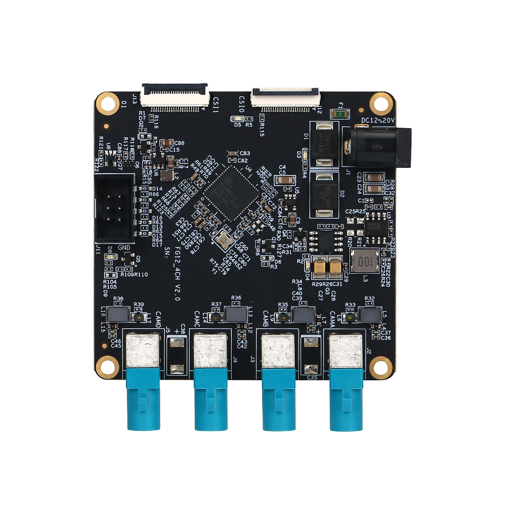
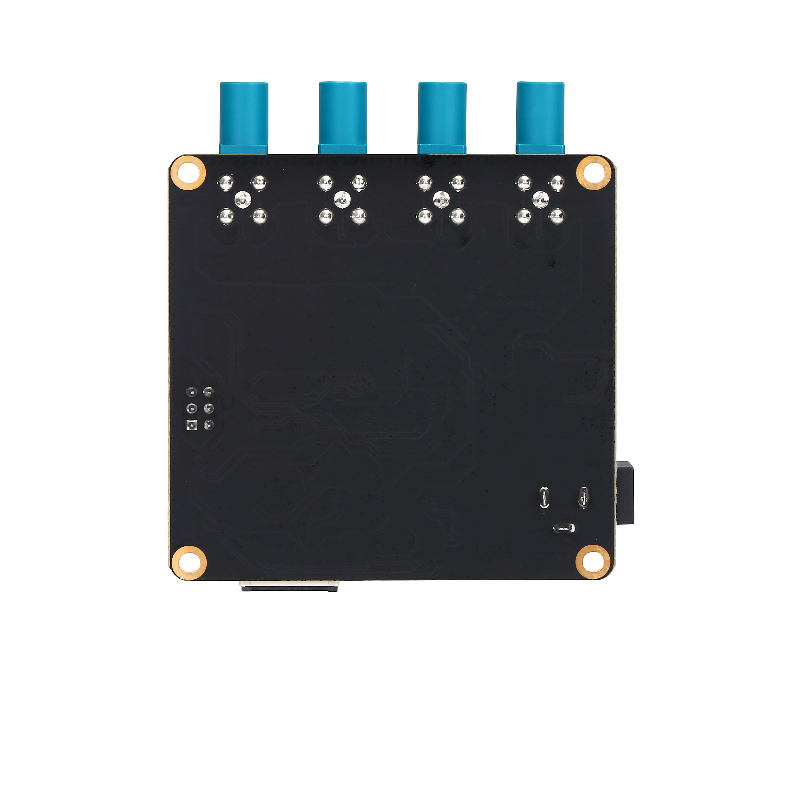
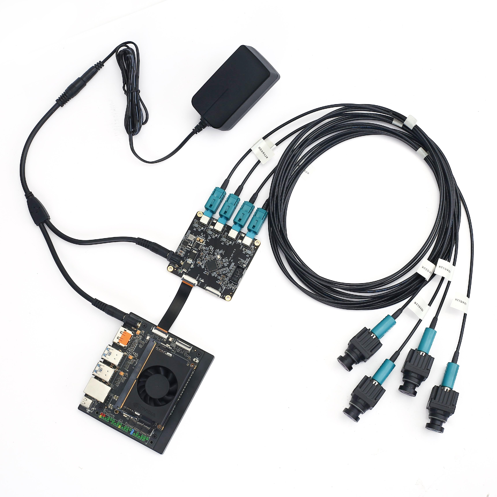
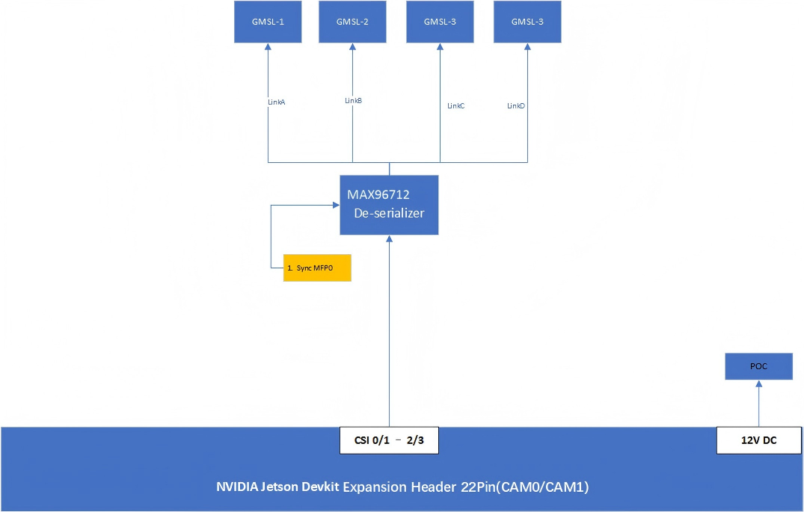
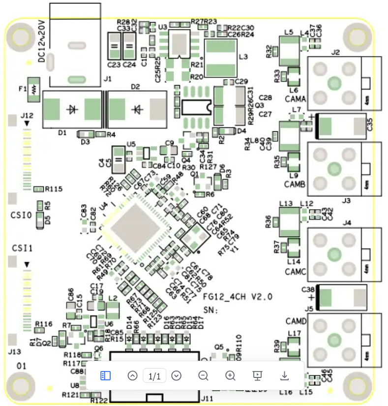

# FG12_4CH GMSL相机平台产品手册

**竹影智能机器人（深圳）有限公司**

---

## 1. 产品简介

### 产品介绍

● FG12_4CH GMSL板是竹影智能/方竹科技基于 ADI Deserilaizer芯片MAX96712开发的4路GMSL采集板，以下简称采集板 。
● 此采集板可同时接入至多4个GMSL相机并输出CSI信号到NVIDIA® Jetson Orin™ NX开发套件(亦可接于Xavier NX开发套件上)
●此采集板可通过软件配置的方式让MAX96712自适应的解析GMSL1与GMSL2不同速率的GMSL相机。
●NVIDIA Jetson® Orin/Xavier™ NX开发套件上22Pin连接器不能提供相机所需电源，因此采集板通过一个可插拔的12V-24V的DC电源外部连接器（可与套件采用同一电源适配器）
FG12_4CH GMSL相机平台是一个扩展板，允许多达4个相机连接到Jetson® AGX Orin™/Xavier™模块，它与NVIDIA Jetson® AGX Orin™/Xavier™开发套件完全兼容。自适应的工作在不同频率即通过软件配置同时兼容GMSL1与GMSL2协议接口。

易于在自主移动机器人（AMR）机器人技术、无人机（UAV）及汽车等应用中安装及使用。

### 1.1 产品图片







### 1.2 产品特点

| 特点 | 描述 |
|------|------|
| 协议兼容 | GMSL2 和 GMSL1协议兼容 |
| 供电方式 | Power over Coax同轴供电 |
| 电压输出 | 相机供电外部输出支持宽压输出 |
| 保护功能 | 电路内置过压及短路保护 |
| 电源控制 | 软件可控制相机的供电 |
| 尺寸适配 | 尺寸小巧适配AGX Orin/Xavier Devkit |

### 1.3 产品规格

| 项目 | 参数 |
|------|------|
| 尺寸 | 104mm × 74mm |
| 重量 | 50g |
| Jetson Devkit接口 | Molex 22Pin ZIF连接器(4Lane CSI) |
| 相机输入数量 | 4路GMSL2或GMSL1相机（RGB/RGBD等均兼容支持） |
| 解串器 | ADI MAX96712 |
| MIPI输出 | 每个解串器接入一个4-Lane MIPI CSI-2 v1.3（总计16-Lanes） |
| 相机连接器 | 单端立式FAKRA连接器 |
| PoC供电 | 8路相机供电由GMSL板提供，POC 12V电压 |
| 电源输入 | 支持外接12V~24V @ 4A MAX |
| 工作温度 | -20℃ ~ +65℃（-4℉ ~ +149℉） |
| 质保支持 | 一年质保和技术支持 |


---

## 3. 安全说明

在使用产品之前，必须先查阅本文档，对该产品有初步的认识与了解，且须遵守本产品使用手册中的安全说明以保证您的个人安全并避免损坏设备，若盲目操作造成损失或伤害，制造商对其错误操作造成的设备及个人生命财产安全的任何问题均不负责。

### 3.1 人身安全

- 操作设备前，应穿防静电工作服，佩戴防静电手套或腕带，并去除首饰和手表等易导电物体，以免被电击或灼伤。
- 如果发生火灾，应撤离建筑物或设备区域并按下火警警铃，或者拨打火警电话。任何情况下，严禁再次进入燃烧的建筑物。

### 3.2 电源电压

- FG12_4CH载板支持输入电源范围：12V~24V，电流：2A以上

### 3.3 环境要求

- 工作温度：-20℃ ~ 65℃
- 通风要求：计算平台安装的周边必须有良好通风条件。
- 接地要求：电源适配器的供电源必须有良好的接地，特殊场景下需安装接地螺丝对接大地。

### 3.4 静电防护

电子元件和电路对静电放电很敏感，虽然本公司在设计电路板卡产品时会对板卡上的主要接口做防静电保护设计，但很难对所有元件及电路做到防静电安全防护。因此在处理任何电路板组件时，建议遵守防静电安全保护措施：

1. 运输、存储过程中应将盒子放在防静电袋中，直至安装部署时再拿此载板板卡；
2. 在身体接触盒子之前应将身体内寄存的静电释放掉：佩戴放电接地腕带；
3. 仅在静电放电安全区域内操作盒子；
4. 避免在铺有地毯的区域搬移盒子。

---

## 4. 产品框图

### 4.1 框图说明



**注意：**

1. I2C总线号为硬件位置(匹配连接器J12、J13引脚)。总线号不一定与软件中列出的相对应。
2. 同轴电源是共享的，但每条GMSL线都有自己的PoC滤波器。

---

## 5. 位号图

### 5.1 位号布局



---

## 6. 对外接口

### 7.1 接口总览

| 序号 | 名称 | 标识 | 备注 |
|------|------|------|------|
| 1 | 电源输入接口 | J1 | 支持12V~24V DC输入 |
| 2 | CAM0 | J2 | FAKRA同轴连接器，GMSL输入接口 |
| 3 | CAM1 | J3 | FAKRA同轴连接器，GMSL输入接口 |
| 4 | CAM2 | J4 | FAKRA同轴连接器，GMSL输入接口 |
| 5 | CAM3 | J5 | FAKRA同轴连接器，GMSL输入接口 |
| 6 | 外部输入触发信号接口 | J11 | 2.54-2*3P |
| 7 | CSI0 | J12 | Molex 22Pin ZIF连接器(4Lane CSI)接口 |
| 8 | CSI1 | J13 | Molex 22Pin ZIF连接器(4Lane CSI)接口 |

---

## 7. 接口功能

### 7.1 J1 - 电源输入接口

**功能：** POWER电源输入

**标识：** J1

**类型/型号：** JPD1030-N521-4F

| 引脚 | 信号 |
|------|------|
| 1 | 12V~24V |
| 2 | GND |
| 3 | GND |

### 7.2 J11 - 外部输入触发信号连接器

**功能：** 外部输入触发信号连接器

**标识：** J11

**类型/型号：** 2.54-2*3P

| 引脚 | 信号 | 引脚 | 信号 |
|------|------|------|------|
| 1 | MAX1_ALL_SYNC | 4 | MAX1_CSI2_SYNC |
| 2 | MAX1_CSI0_SYNC | 5 | MAX1_CSI3_SYNC |
| 3 | MAX1_CSI1_SYNC | 6 | GND |

### 7.2 J2/J3/J4/J5 - FAKRA连接器

**功能：** GMSL相机应用接口

**标识：** J2、J3、J4、J5

**类型/型号：** 安费诺卧式单端同轴连接器FK1252ZW-031-TLCP5G-50

**功能简介：** GMSL相机应用接口基于V4L2，为驱动和应用程序提供了一套统一的接口规范。

#### 8.3.1 FAKRA连接器引脚定义

| 引脚 | 信号 |
|------|------|
| 1 | MAX1_SIOx_P |
| 2 | GND |
| 3 | GND |
| 4 | GND |
| 5 | GND |

#### 8.3.2 物理接口与设备节点对应关系

| 物理接口 | 标识 | 设备节点 | 备注 |
|----------|------|----------|------|
| GMSL0~3 | J2~J5 | /dev/video0 ~ /dev/video3 | 对应IIC-9 |
| GMSL4~7 | J4~J5 | /dev/video4 ~ /dev/video7 | 对应IIC-10 |

### 7.2 J12/J13 - Molex 22Pin CSI输出

**功能：** CSI输出接口

**标识：** J12、J13

**类型/型号：** AFC01-S22FCC-00

#### 7.3.1 J12连接器引脚定义

| 引脚 | 信号 | 引脚 | 信号 |
|------|------|------|------|
| 1 | GND | 13 | GND |
| 2 | MAX1_CSI0_DATA0_N | 14 | MAX1_CSI1_DATA1_N |
| 3 | MAX1_CSI0_DATA0_P | 15 | MAX1_CSI1_DATA1_P |
| 4 | GND | 16 | GND |
| 5 | MAX1_CSI0_DATA1_N | 17 | MAX1_ALL_SYNC_C |
| 6 | MAX1_CSI0_DATA1_P | 18 | NC |
| 7 | GND | 19 | GND |
| 8 | MAX1_CSI0_CKA_N | 20 | MAX1_SCL_CON |
| 9 | MAX1_CSI0_CKA_P | 21 | MAX1_SDA_CON |
| 10 | GND | 22 | VCC_3V3 |
| 11 | MAX1_CSI1_DATA0_N | 23 | GND |
| 12 | MAX1_CSI1_DATA0_P | 24 | GND |

#### 7.3.2 J13连接器引脚定义

| 引脚 | 信号 | 引脚 | 信号 |
|------|------|------|------|
| 1 | GND | 13 | GND |
| 2 | MAX1_CSI2_DATA0_N | 14 | MAX1_CSI3_DATA1_N |
| 3 | MAX1_CSI2_DATA0_P | 15 | MAX1_CSI3_DATA1_P |
| 4 | GND | 16 | GND |
| 5 | MAX1_CSI2_DATA1_N | 17 | MAX1_ALL_SYNC_C |
| 6 | MAX1_CSI2_DATA1_P | 18 | NC |
| 7 | GND | 19 | GND |
| 8 | MAX1_CSI2_CKA_N | 20 | MAX1_SCL_CON |
| 9 | MAX1_CSI2_CKA_P | 21 | MAX1_SDA_CON |
| 10 | GND | 22 | VCC_3V3 |
| 11 | MAX1_CSI3_DATA0_N | 23 | GND |
| 12 | MAX1_CSI3_DATA0_P | 24 | GND |

---

## 8. 相机测试

### 8.1 相机配置

按照产品图片进行连接，CAM接口对应勾选CAM5~8配置。支持动态接入和加载相机，通过运行`sudo fzcam_ui`运行并配置CAM5~8，进而选择不同相机品牌和Sensor型号。如需启用CAM1~4定制化配置，请联系查询官网或销售人员进行沟通。

**操作步骤：**

1. 选择"GMSL位置"对应摄像头节点
2. 选择"厂商"
3. 选择"型号"
4. 保存配置
5. 运行配置

**同步触发场景：**

如相机需同步触发，请连接AGX套件PIN33->FG12-4CH的MAX1_CSI0_SYNC, AGX套件PIN34->FG12-4CH的GND。

### 8.2 相机配置界面


### 8.3 RGB相机快速验证及参考代码

设备支持使用Gstreamer输出视频流，图像获取与显示使用方法如下：

#### 8.3.1 8M相机（3840×2160）

```bash
gst-launch-1.0 v4l2src device=/dev/video0 ! "video/x-raw, format=(string)UYVY, width=(int)3840, height=(int)2160" ! videoconvert ! fpsdisplaysink video-sink=xvimagesink sync=false
```

#### 8.3.2 5M相机（2880×1860）

```bash
gst-launch-1.0 v4l2src device=/dev/video0 ! "video/x-raw, format=(string)UYVY, width=(int)2880, height=(int)1860" ! videoconvert ! fpsdisplaysink video-sink=xvimagesink sync=false
```

#### 8.3.3 2M相机（1920×1080）

```bash
gst-launch-1.0 -ev v4l2src device=/dev/video0 ! "video/x-raw, format=(string)UYVY, width=(int)1920, height=(int)1080" ! fpsdisplaysink text-overlay=0 video-sink=fakesink sync=0
```

#### 8.3.4 1M相机（1280×720）

```bash
gst-launch-1.0 -ev v4l2src device=/dev/video0 ! "video/x-raw, format=(string)UYVY, width=(int)1280, height=(int)720" ! fpsdisplaysink text-overlay=0 video-sink=fakesink sync=0
```

**说明：** 其他分辨率相机根据具体相机参数进行设置即可。相机支持列表可以查询官网或销售人员获取。

---

## 9. 保修条例

### 9.1 重要提示

竹影智能机器人（深圳）有限公司保证提供的全部产品，就其所知在材料与工艺上均无任何缺陷，完全符合原厂正式发货之规格。

竹影智能机器人（深圳）有限公司保修范围包括全部原厂产品，由经销商配置的配件出现故障时请与经销商协商解决。公司提供的所有产品的保修期限均为一年（超出保修期限的提供终身维修服务），保修期限的起始时间自出厂之日起开始计算，对于保修期内维修好的产品，维修部分延长质保12个月。除非竹影智能机器人（深圳）有限公司另行通知，否则您的原厂发货单日期即为出厂日期。

### 9.2 如何获得保修服务

如果您在保修期内产品不能正常运行，请与竹影智能机器人（深圳）有限公司联系以获得保修服务，产品保修时请出示购货发票证明（这是您获得保修服务的权利证明）。

### 9.3 保修解决措施

当您要求保修服务时，您需要遵循竹影智能机器人（深圳）有限公司规定的问题确定和解决程序。您需要接受技术人员通过电话、微信或电子邮件方式与您进行首次诊断，届时需要您配合详细填写我们所提供的报修单上所有问题，以确保我们准确判断故障原因及造成损毁位置（过保产品我们还会提供收费单，需要您确认）。

竹影智能机器人（深圳）有限公司有权对所报修产品进行"维修"或"更换"，如果产品被"更换"或"维修"，被更换的"故障"产品或修理后更换后的"故障"零件将被返回竹影智能机器人（深圳）有限公司。

因部分维修产品需发往原厂，为避免意外损失，竹影智能机器人（深圳）有限公司提请您购买运输保险，如果用户放弃保险，那么所寄物品在运输途中损坏或遗失，竹影智能机器人（深圳）有限公司不承担责任。

对于保修期限内的产品：
- 用户承担维修产品返回厂家时的运费
- 竹影智能机器人（深圳）有限公司承担维修后的产品返还用户的运费

### 9.4 以下情况不在保修之列

1. 产品的不适当安装、使用不当、误用、滥用（如超出工作负荷等）
2. 不当的维护保管（如火灾、爆炸等）或自然灾害（如雷电、地震、台风等）所致产品故障或损坏
3. 对产品的改动（如电路特性、机械特性、软件特性、三防处理等）
4. 其他显然是由于使用不当造成的故障（如电压过高、电压过低、极性接反、针脚弯曲或折断、接错总线、器件脱落、静电击穿、外力挤压、坠落损坏、温度过高、湿度过大、运输不良等）
5. 产品上的标志和部件号曾被删改或去除
6. 产品超过保修期

### 9.5 特别说明

如多个产品出现同一故障或多次在同一设备出现相同故障或损坏时，为查找原因以确认责任。我司有权要求使用者提供周边设备实物或技术资料，例如：监视器，外接设备，电缆，电源，连接示意图，系统结构图等。否则，我们有权拒绝履行保修，维修时将按照市场价格收取费用，并收取维修保证金。

---

**文档版本：** V1.0

**公司名称：** 竹影智能机器人（深圳）有限公司
