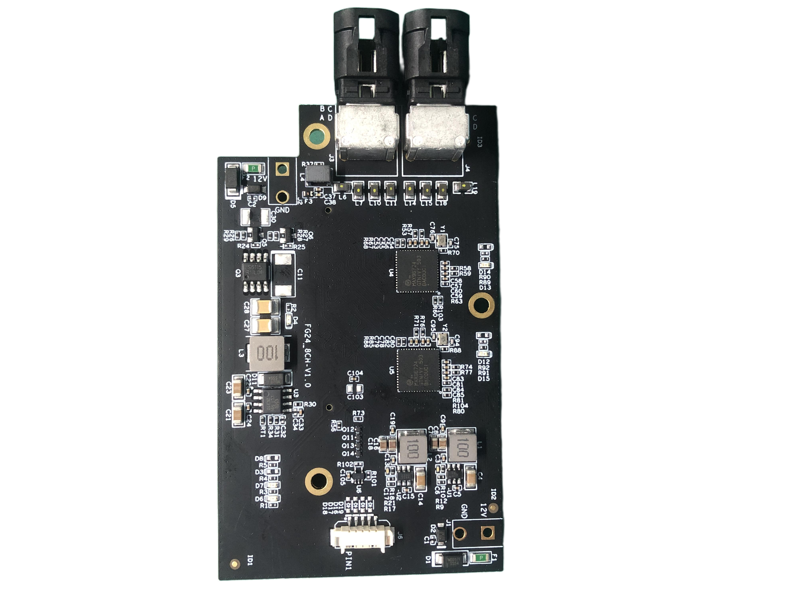
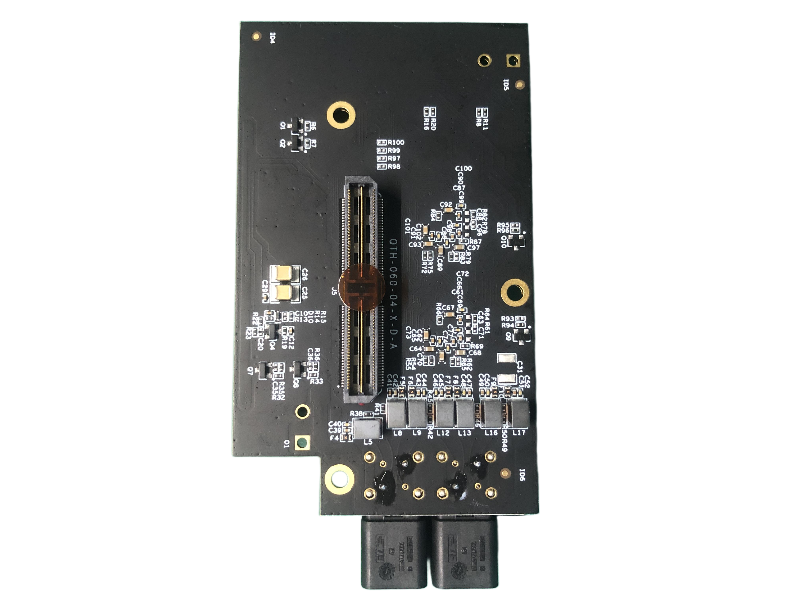
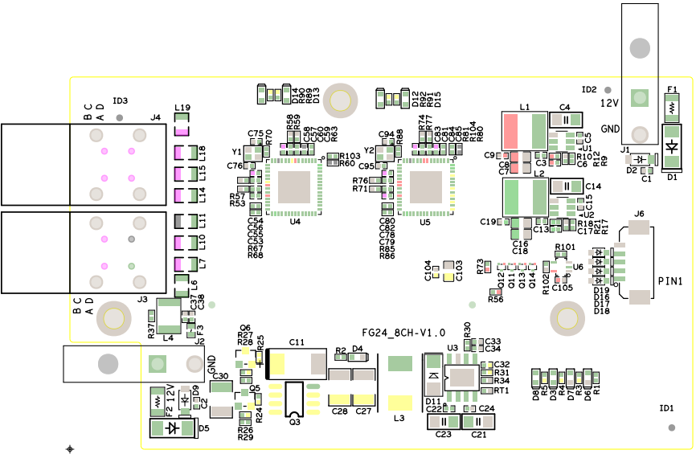
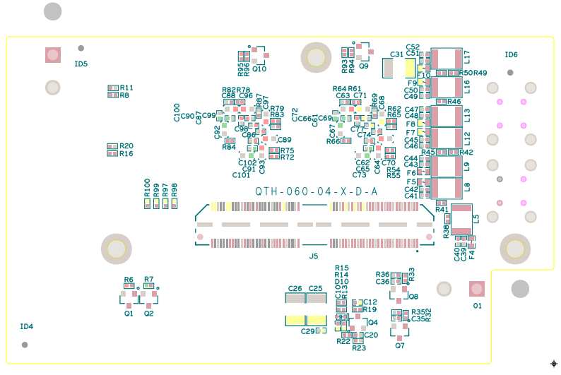
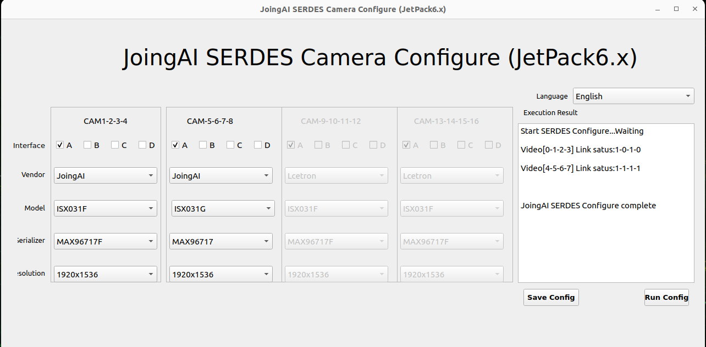

# FG24_8CH GMSL Camera Platform Product Manual

**Zhuying Intelligent Robot (Shenzhen) Co., Ltd.**

---

## 1. Product Introduction

FG24_8CH GMSL Camera Platform is an expansion board that allows up to 8 cameras to connect to Jetson AGX Orin/Xavier modules.

### Product Introduction

● FG24_8CH GMSL Board is a 8-channel GMSL capture  board  developed  by  Zhuying  Intelligent  /  Fangzhu  Tech nology
based on the ADI Deserializer chips MAX96724, hereinafter referred to as the Capture Board.
● This capture board supports up to 8 GMSL cameras simultaneously and outputs CSI signals to the NVIDIA® Jetson AGX Orin™ Development Kit (also compatible with the AGX Xavier Development Kit).
●Through software configuration, the MAX96724 can  adaptively  support  GMSL  cameras  with  different rates of GMSL1 and GMSL2 (3G/6G).
●The 120Pin connector on the NVIDIA Jetson® AGX Orin™ Devkit cannot provide sufficient power for cameras. Therefore,the capture board uses a pluggable 12V–24V DC external power connector (can share the same power adapter as the kit).

facilitating installation and use in applications such as Autonomous Mobile Robots (AMR), Unmanned Aerial Vehicles (UAV) and automotive systems.

### 1.1 Product Images





FG24_8CH/pic3.png)

### 1.2 Product Features

| Feature | Description |
|---------|-------------|
| Protocol Compatibility | GMSL2 and GMSL1 protocol compatible |
| Power Supply | Power over Coax |
| Voltage Output | Camera power supply supports wide voltage output |
| Protection | Built-in overvoltage and short-circuit protection |
| Power Control | Camera power can be controlled by software |
| Size | Compact size for AGX Orin/Xavier Devkit |

### 1.3 Product Specifications

| Item | Specification |
|------|--------------|
| Dimensions | 104mm × 74mm |
| Weight | 50g |
| Jetson Devkit Interface | 120Pin High Density Connector |
| Camera Inputs | 8-channel GMSL2/GMSL1 cameras |
| Deserializer | ADI MAX9296A |
| MIPI Output | CSI-2 v1.3 (16-Lanes) |
| Camera Connector | 4-in-1 FAKRA connector |
| PoC Power Supply | 8-channel camera power |
| Power Input | 12V~24V @ 4A MAX |
| Operating Temperature | -20°C ~ +65°C |
| Warranty | One year warranty and technical support |


---

## 3. Safety Instructions

Before using the product, you must read this document carefully to gain a preliminary understanding of the product. Always comply with the safety instructions in this manual to ensure personal safety and avoid equipment damage. The manufacturer shall not be liable for any damage to equipment or personal life and property caused by incorrect operation.

### 3.1 Personal Safety

- Before operating the equipment, wear anti-static work clothes, anti-static gloves or wristbands, and remove jewelry, watches, and other conductive objects to avoid electric shock or burns.
- In case of fire, evacuate the building or equipment area and press the fire alarm bell, or call the fire department. Under no circumstances should you re-enter a burning building.

### 3.2 Power Supply Voltage

- The FG24_8CH carrier board supports input voltage range: 12V~24V, current: 2A or above

### 3.3 Environmental Requirements

- Operating temperature: -20°C ~ 65°C
- Ventilation: Good ventilation must be provided around the installed computing platform.
- Grounding: The power adapter must be properly grounded. In special scenarios, grounding screws may be required for earth connection.

### 3.4 ESD Protection

Electronic components and circuits are sensitive to electrostatic discharge. Although our company designs anti-static protection for main interfaces on the board, it is difficult to protect all components and circuits. Therefore, when handling any circuit board components, please follow these ESD protection measures:

1. During transportation and storage, keep the board in an anti-static bag until installation.
2. Before touching the board, discharge static electricity from your body by wearing a grounding wristband.
3. Only operate the board in an ESD-safe area.
4. Avoid moving the board in carpeted areas.

---

## 4. Block Diagram

### 4.1 Diagram Description


**Notes:**

1. I2C bus numbers correspond to hardware positions (matching connector J5 pins). Bus numbers may not correspond to those listed in software.
2. Coaxial power is shared, but each GMSL line has its own PoC filter.

---

## 5. Component Placement Diagram

### 5.1 Placement Layout





---

## 6. External Interfaces

### 7.1 Interface Overview

| No. | Name | ID | Remarks |
|-----|------|-----|---------|
| 1 | CAM0~3 | J3 | 4-in-1 FAKRA |
| 2 | CAM4~7 | J4 | 4-in-1 FAKRA |
| 3 | Power Input | J1 | 1*2P connector |
| 4 | External Trigger | J6 | 1*5P |
| 5 | BTB Connector | J5 | BTB high-speed |

---

## 7. Interface Functions

### 7.1 J1 - Power Input Interface

**Function:** POWER input

**ID:** J1

**Type/Model:** 1724480002

| Pin | Signal |
|-----|--------|
| 1 | 12V~24V |
| 2 | GND |

### 7.2 J6 - External Trigger Connector

**Function:** External trigger signal

**ID:** J6

**Type/Model:** HC-1.25-5P WT

| Pin | Signal |
|-----|--------|
| 1 | MAX_ALL_SYNC1 |
| 2 | MAX_ALL_SYNC3 |
| 3 | MAX_ALL_SYNC2_CON |
| 4 | MAX_ALL_SYNC4 |
| 5 | GND |

### 7.2 J3/J4 - 4-in-1 FAKRA Connectors

**Function:** GMSL camera interface

**ID:** J3, J4

**Type/Model:** 2321775-1

#### 8.3.1 4-in-1 FAKRA Pin Definition

| Pin | Signal |
|-----|--------|
| 1 | MAXx_SIOD_P |
| 2 | MAXx_SIOC_P |
| 3 | MAXx_SIOB_P |
| 4 | MAXx_SIOA_P |
| 5 | GND |
| 6 | GND |
| 7 | GND |
| 8 | GND |

#### 8.3.2 Physical Interface to Device Node Mapping

| Physical Interface | ID | Device Node |
|-------------------|-----|------------|
| GMSL0~3 | J3 | /dev/video0 ~ /dev/video3 |
| GMSL4~7 | J4 | /dev/video4 ~ /dev/video7 |

### 7.2 J5 - BTB Connector

**Function:** Module connection interface

**ID:** J5

**Type/Model:** 120PIN Height 8mm QTH-060-02-F-D-A-K-TR

#### 7.3.1 J5 Connector Pin Definition (120Pin)

| Pin | Signal | Pin | Signal | Pin | Signal | Pin | Signal |
|-----|--------|-----|--------|-----|--------|-----|--------|
| 1 | MAX1_CSI0_DATA0_P | 31 | MAX1_CSI2_DATA1_P | 61 | MAX2_CSI5_DATA0_N | 91 | NC |
| 2 | MAX1_CSI1_DATA0_P | 32 | MAX1_CSI3_DATA1_P | 62 | MAX2_CSI7_DATA0_N | 92 | NC |
| 3 | MAX1_CSI0_DATA0_N | 33 | MAX1_CSI2_DATA1_N | 63 | GND | 93 | MAX1_PWDNB |
| 4 | MAX1_CSI1_DATA0_N | 34 | MAX1_CSI3_DATA1_N | 64 | GND | 94 | MAX_ALL_SYNC4 |
| 5 | GND | 35 | GND | 65 | MAX2_CSI5_CKC_P | 95 | NC |
| 6 | GND | 36 | GND | 66 | MAX2_CSI7_CKF_P | 96 | NC |
| 7 | MAX1_CSI1_CKC_P | 37 | MAX2_CSI4_DATA0_P | 67 | MAX2_CSI5_CKC_N | 97 | MAX_ALL_SYNC3 |
| 8 | MAX1_CSI0_CKA_P | 38 | MAX2_CSI6_DATA0_P | 68 | MAX2_CSI7_CKF_N | 98 | MAX_ALL_SYNC2 |
| 9 | MAX1_CSI1_CKC_N | 39 | MAX2_CSI4_DATA0_N | 69 | GND | 99 | GND |
| 10 | MAX1_CSI0_CKA_N | 40 | MAX2_CSI6_DATA0_N | 70 | GND | 100 | GND |
| 11 | GND | 41 | GND | 71 | MAX2_CSI5_DATA1_P | 101 | NC |
| 12 | GND | 42 | GND | 72 | MAX2_CSI7_DATA1_P | 102 | NC |
| 13 | MAX1_CSI0_DATA1_P | 43 | MAX2_CSI4_CKA_P | 73 | MAX2_CSI5_DATA1_N | 103 | NC |
| 14 | MAX1_CSI1_DATA1_P | 44 | MAX2_CSI6_CKB_P | 74 | MAX2_CSI7_DATA1_N | 104 | NC |
| 15 | MAX1_CSI0_DATA1_N | 45 | MAX2_CSI4_CKA_N | 75 | MAX1_SCL_CON | 105 | MAX2_SCL_CON |
| 16 | MAX1_CSI1_DATA1_N | 46 | MAX2_CSI6_CKB_N | 76 | NC | 106 | NC |
| 17 | GND | 47 | GND | 77 | MAX1_SDA_CON | 107 | MAX2_SDA_CON |
| 18 | GND | 48 | GND | 78 | NC | 108 | VCC_3V3 |
| 19 | MAX1_CSI2_DATA0_P | 49 | MAX2_CSI4_DATA1_P | 79 | GND | 109 | NC |
| 20 | MAX1_CSI3_DATA0_P | 50 | MAX2_CSI6_DATA1_P | 80 | GND | 110 | VCC_3V3 |
| 21 | MAX1_CSI2_DATA0_N | 51 | MAX2_CSI4_DATA1_N | 81 | NC | 111 | NC |
| 22 | MAX1_CSI3_DATA0_N | 52 | MAX2_CSI6_DATA1_N | 82 | AVDD_CAM_2V8 | 112 | NC |
| 23 | GND | 53 | GND | 83 | NC | 113 | NC |
| 24 | GND | 54 | GND | 84 | NC | 114 | NC |
| 25 | MAX1_CSI2_CKB_P | 55 | NC | 85 | MAX_ALL_SYNC1 | 115 | GND |
| 26 | MAX1_CSI3_CKF_P | 56 | NC | 86 | NC | 116 | GND |
| 27 | MAX1_CSI2_CKB_N | 57 | NC | 87 | NC | 117 | NC |
| 28 | MAX1_CSI3_CKF_N | 58 | NC | 88 | NC | 118 | VCC_3V3 |
| 29 | GND | 59 | MAX2_CSI5_DATA0_P | 89 | NC | 119 | POC_PWR_EN |
| 30 | GND | 60 | MAX2_CSI7_DATA0_P | 90 | MAX2_PWDNB | 120 | VCC_3V3 |

---

## 8. Camera Testing

### 8.1 Camera Configuration

Run `sudo fzcam_ui` to configure CAM0~7, then select camera brands and models.

**Operation Steps:**

1. Select GMSL position for camera node
2. Select Manufacturer
3. Select Model
4. Save configuration
5. Run configuration

### 8.2 Camera Configuration Interface



### 8.3 RGB Camera Quick Verification and Reference Code

The device supports video output using Gstreamer. Image capture and display methods are as follows:

#### 8.3.1 8MP Camera (3840×2160)

```bash
gst-launch-1.0 v4l2src device=/dev/video0 ! "video/x-raw, format=(string)UYVY, width=(int)3840, height=(int)2160" ! videoconvert ! fpsdisplaysink video-sink=xvimagesink sync=false
```

#### 8.3.2 5MP Camera (2880×1860)

```bash
gst-launch-1.0 v4l2src device=/dev/video0 ! "video/x-raw, format=(string)UYVY, width=(int)2880, height=(int)1860" ! videoconvert ! fpsdisplaysink video-sink=xvimagesink sync=false
```

#### 8.3.3 2MP Camera (1920×1080)

```bash
gst-launch-1.0 -ev v4l2src device=/dev/video0 ! "video/x-raw, format=(string)UYVY, width=(int)1920, height=(int)1080" ! fpsdisplaysink text-overlay=0 video-sink=fakesink sync=0
```

#### 8.3.4 1MP Camera (1280×720)

```bash
gst-launch-1.0 -ev v4l2src device=/dev/video0 ! "video/x-raw, format=(string)UYVY, width=(int)1280, height=(int)720" ! fpsdisplaysink text-overlay=0 video-sink=fakesink sync=0
```

**Note:** For cameras with other resolutions, configure according to specific camera parameters. Please contact our sales team or visit our website for the camera support list.

---

## 9. Warranty Terms

### 9.1 Important Notice

Zhuying Intelligent Robot (Shenzhen) Co., Ltd. warrants that all products provided are free from defects in materials and workmanship to the best of its knowledge, and fully conform to the specifications of the original factory shipment.

Zhuying Intelligent Robot (Shenzhen) Co., Ltd.'s warranty covers all original products. For failures of accessories configured by distributors, please contact the distributor for resolution. All products provided by the company are covered by a one-year warranty (lifetime repair service is provided beyond the warranty period). The warranty period starts from the date of manufacture. For products repaired within the warranty period, the repaired parts enjoy an extended 12-month warranty. Unless otherwise notified by Zhuying Intelligent Robot (Shenzhen) Co., Ltd., the date on your original delivery note is the date of manufacture.

### 9.2 How to Obtain Warranty Service

If your product fails to operate properly within the warranty period, please contact Zhuying Intelligent Robot (Shenzhen) Co., Ltd. for warranty service. When claiming warranty, please present your purchase invoice (this is your proof of entitlement to warranty service).

### 9.3 Warranty Resolution Procedures

When requesting warranty service, you need to follow the problem determination and resolution procedures specified by Zhuying Intelligent Robot (Shenzhen) Co., Ltd.. You need to accept the initial diagnosis by technical personnel via phone, WeChat, or email. You will be required to complete all questions on the repair form we provide to ensure we accurately determine the cause of the failure and the location of damage (for out-of-warranty products, we will also provide a fee estimate for your confirmation).

Zhuying Intelligent Robot (Shenzhen) Co., Ltd. reserves the right to "repair" or "replace" the claimed product. If the product is "replaced" or "repaired", the replaced "faulty" product or the "faulty" parts after repair will be returned to Zhuying Intelligent Robot (Shenzhen) Co., Ltd..

Since some repaired products need to be sent to the original factory, to avoid accidental losses, Zhuying Intelligent Robot (Shenzhen) Co., Ltd. recommends that you purchase transportation insurance. If you waive insurance, Zhuying Intelligent Robot (Shenzhen) Co., Ltd. shall not be liable for damage or loss of the shipped items during transportation.

For products within the warranty period:
- The user bears the shipping cost for returning the product to the factory
- Zhuying Intelligent Robot (Shenzhen) Co., Ltd. bears the shipping cost for returning the repaired product to the user

### 9.4 The Following Cases Are Not Covered by Warranty

1. Improper installation, misuse, or abuse (such as exceeding working load, etc.)
2. Faults or damage caused by improper maintenance (such as fire, explosion, etc.) or natural disasters (such as lightning, earthquake, typhoon, etc.)
3. Alterations to the product (such as circuit characteristics, mechanical characteristics, software characteristics, anti-corrosion treatment, etc.)
4. Other faults obviously caused by improper use (such as overvoltage, undervoltage, reverse polarity, bent or broken pins, wrong bus connection, component falling off, electrostatic breakdown, external force extrusion, drop damage, excessive temperature, excessive humidity, poor transportation, etc.)
5. The marks and part numbers on the product have been deleted or removed
6. The product is beyond the warranty period

### 9.5 Special Note

If multiple products experience the same fault or the same fault occurs repeatedly on the same equipment, to find the cause and confirm responsibility, our company reserves the right to request the user to provide physical or technical information of peripheral equipment, such as monitors, external devices, cables, power supplies, connection diagrams, system structure diagrams, etc. Otherwise, we reserve the right to refuse warranty service. Repairs will be charged at market prices, and a repair deposit will be required.

---

**Document Version:** V1.0

**Company Name:** Zhuying Intelligent Robot (Shenzhen) Co., Ltd.
